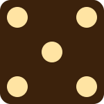
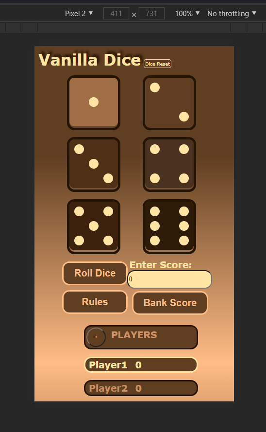
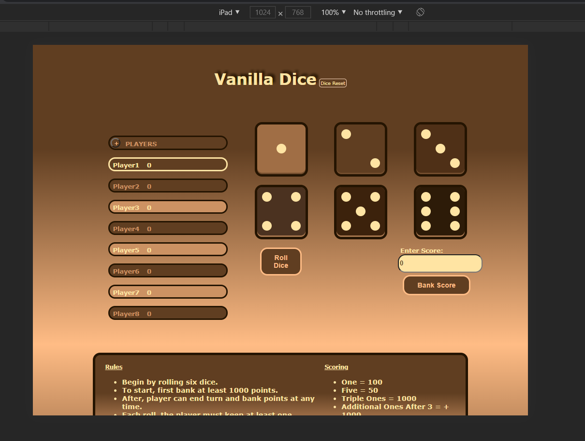

# Vanilla Dice

> Project includes a README file that explains the following:
A one paragraph or longer description of what your project is
### A dice roller designed to share a game of dice with friends. There are six dice total. To roll a lesser number of dice, click to highlight the dice you do not want to roll. Then click the "Roll Dice" button. Suggested Rules are displayed when the "Rules" button in clicked.
***
Please try out the game at <a href="https://evandbush.github.io/">my project's Github site!</a>
***

The inspiration for this project came from playing dice with my family over Zoom. We did it, but it was difficult. Everyone had to have a set of six dice to play and it was hard to roll in a way everyone could see. With this site. no physical dice are needed and everyone can display their own set of dice.

<p>The dice are styled so that each dice face is a set color. This makes matching numbers easier to spot.</p> 




<p>This is an advantage over typical monochromatic physical dice. One of the aspects I miss about physical dice is the suspense in rolling, a computer is just too fast. If you have any suggestions on fun ways to add suspense, I'd love to hear them!</p>


>Which 3+ features you have included from the below lists to meet the requirements

>If needed, any special instructions required for the reviewer to run your project

>The readme should be called readme.md or readme.txt and located in the top level of your project folder so that GitHub automatically displays it when viewing your project on GitHub


## CSS Features
>Choose at least 1 item on the CSS Features List below and implement it in your project
1. ### CSS Grid 
<div style="display: grid; grid-template-columns: auto auto;">
<div style="float: left; margin: 10px 4px 10px 4px;">
    First I started out with a two column view for mobile devices. On small screens, all dice and the roll button are visible. If the user scrolls down to the players score box, they can click the tag at the bottom of the page to jump back to the top.
    


        .grid-box {
        display: grid;
        grid-template-columns: 150px 150px;
        column-gap: 2%;
        row-gap: 1%;
        justify-items: center;
    }
</div>

<div style= "margin: 0px 3px 5px 0px">



</div>

</div>

</div>


***
***

<div style="margin: 8px 0px 5px 0px;">
<div>
    For larger screens I added a third column to fill the space better and make room for more content below. Inside this space, the rules and scoring box is displayed all the time. 
</div>


***
***

<div>

    @media (min-width: 1000px) {
    .grid-box {
            display: grid;
            grid-template-columns:  
                155px 155px 155px;
            column-gap: 2%;
            row-gap: 2%;
            justify-self: left;
            justify-items: center;
            margin: 0%;
        }
    };  
</div>


> Use CSS Grid to organize content areas based on mobile or desktop views. Simply applying a basic flex property so that text wraps as you change screen sizes does not count. You must actually rearrange content or perform some more advanced feature. For example, swapping from a single column layout to a two-column layout on desktop.

2. ### CSS Flexbox

By styling the main section with flexbox, the individual content containers fill the space better at different screen sizes. At first, the containers  
```
main {
    display: flex;
    flex-direction: row;
    flex-wrap: wrap;
    justify-content: space-around;
    padding: 2%;
}
```
```
main {
        display: flex;
        flex-direction: row-reverse;
        flex-wrap: wrap;
        justify-content: space-around;
        padding: 2%;
        margin: 5%;
    }

    article {
        flex-basis: auto ;
        min-width: 300px;
        max-height: fit-content;
    }
```
3. ### :nth-child


```
.inert-player:nth-of-type(2n) {
    background-color: #cc9263;
    color: #ffe4a3;
}
```
> Use “:nth-child” or “nth-of-type” to style a series of elements on your page - for example, change the background color for every other row in a table 

4. ### CSS Animation 

>Create your own original CSS animation. For example, create a loading spinner or menu animation. Note: CSS Animations are not included in the assigned Treehouse track, you will have to research this on your own


## Javascript Features
>Choose at least 1 item off the list of JavaScript Features List below and implement it in your project

1. ### Create a form, validate at least one field, and then use that information on your page somehow.

Enter player name

> Create a form (such as a ‘Contact Us’ form), validate at least one field (ex: email is in the correct format) and then use that information on your page somehow. For example, display it back to the user on button click, or change a setting on the page based on a section. Having a form that does nothing on clicking Submit or that just refreshes the page is not enough - you must capture the value(s) of the form and use it somehow.

```
function addPlayers () {
    let totalPlayers = parseInt(prompt('How many players? (1-8)'));
        for (let namePosition = 0; namePosition < totalPlayers; namePosition++) {
            let playerName = prompt(`Enter a name for Player${namePosition + 1}`);
            document.querySelector(`#player${namePosition + 1}`).innerHTML = playerName;
        }; 
        for (let namePosition = 8; namePosition > totalPlayers; namePosition= namePosition-1) {
            document.querySelector(`#player-name-${namePosition}`).style.display = 'none';
        };
};
```

2. ### JavaScript mathematical function and displays.

Get Random Number, Add score to previous score.

> Create a JavaScript function that performs some form of mathematical operation (calculates something) and displays the result on your page or otherwise uses that value to do something on the site.

3. ### Create and populate a JavaScript array and display.

```
function rollDice () {

    let randomArray = [];
    
        for (let dicePosition = 0; dicePosition < 6; dicePosition++) {
            let myRoll = Math.floor(Math.random() *6) + 1;
            randomArray.push(myRoll);
            let diceSVG = `img/small-dice/face${randomArray[dicePosition]}.svg`;
                if (document.getElementById(`dice${dicePosition + 1}`).className === 'dice') {
                    document.querySelector(`.face${dicePosition}`).setAttribute('src', diceSVG);
        };
    };
};


```

Array of 6 random numbers, display as Dice SVG

> Create and populate a JavaScript array with one or more values and display the contents of some or all of the array on your page

4. ### Create a Javascript loop that displays HTML.

Displays player names, removes empty

```
function addPlayers () {
    let totalPlayers = parseInt(prompt('How many players? (1-8)'));
        for (let namePosition = 0; namePosition < totalPlayers; namePosition++) {
            let playerName = prompt(`Enter a name for Player${namePosition + 1}`);
            document.querySelector(`#player${namePosition + 1}`).innerHTML = playerName;
        }; 
        for (let namePosition = 8; namePosition > totalPlayers; namePosition= namePosition-1) {
            document.querySelector(`#player-name-${namePosition}`).style.display = 'none';
        };
};
```

> Create a Javascript loop that dynamically displays HTML on your page - for example displaying a number of list items <li> based on how many times you loop

5. ### Show/hide one or more content areas or elements.

```
let ruleBox = document.getElementById("rule-box");
let ruleButton = document.getElementById("rule-button");

function showRules () {
    if (ruleBox.className === "hide") {
        ruleBox.setAttribute("class", "show");
    } else {
        ruleBox.setAttribute("class", "hide")} 
};
```

> Show/hide one or more content areas or elements on your site through clicking a button or some other user interaction - must be done with some JavaScript code. 