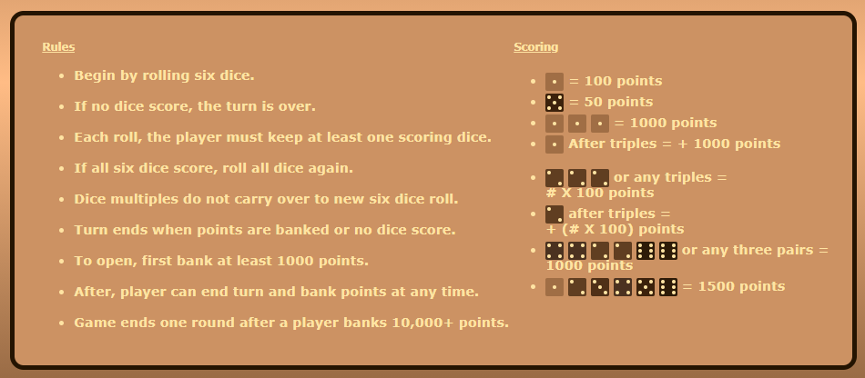

# Vanilla Dice

> Project includes a README file that explains the following:
A one paragraph or longer description of what your project is
<body style="width:100%>
### A dice game designed to share with friends. There are six dice total. To roll a lesser number of dice, click to highlight the dice you do not want to roll. Then click the "Roll Dice" button. Suggested Rules are displayed when the "Rules" button in clicked.



***
Please try out the game at <a href="https://evandbush.github.io/">my project's Github site!</a>
***

The inspiration for this project came from playing dice with my family over Zoom. We did it, but it was difficult. Everyone had to have a set of six dice to play and it was hard to roll in a way everyone could see. With this site. no physical dice are needed and everyone can display their own set of dice.

<p>The dice are styled so that each dice face is a set color. This makes matching numbers easier to spot.</p>

</img>

<p>This is an advantage over typical monochromatic physical dice. One of the aspects I miss about physical dice is the suspense in rolling, a computer is just too fast. If you have any suggestions on fun ways to add suspense, I'd love to hear them!</p>


>Which 3+ features you have included from the below lists to meet the requirements

>If needed, any special instructions required for the reviewer to run your project

>The readme should be called readme.md or readme.txt and located in the top level of your project folder so that GitHub automatically displays it when viewing your project on GitHub


## CSS Features
>Choose at least 1 item on the CSS Features List below and implement it in your project

***
***
1. #### CSS Grid

***
***
<div style="display: grid; grid-template-columns: auto auto; align-items: center">
<div style="float: left; margin: 10px 4px 10px 4px;">
    First I started out with a two column view for mobile devices. On small screens, all dice and the roll button are visible. If the user scrolls down to the players score box, they can click the tag at the bottom of the page to jump back to the top.
    
    .grid-box {
        display: grid;
        grid-template-columns: 150px 150px;
        column-gap: 2%;
        row-gap: 1%;
        justify-items: center;
    }
The items are then assigned a column position and fit themselves into rows in the order they are written.
        
    .first-grid-position {
        grid-column: 1;
    }
    .second-grid-position {
        grid-column: 2;
    }

</div>

<div>


</div>

***
***


<div>
    For larger screens I added a third column to fill the space better and make room for more content below. Inside this space, the rules and scoring box is displayed all the time. 


</div>

<div>

    @media (min-width: 1000px) {
    .grid-box {
            display: grid;
            grid-template-columns:  
                155px 155px 155px;
            column-gap: 2%;
            row-gap: 2%;
            justify-self: left;
            justify-items: center;
            margin: 0%;
        }
    };  
</div>

</div>

***
***


> Use CSS Grid to organize content areas based on mobile or desktop views. Simply applying a basic flex property so that text wraps as you change screen sizes does not count. You must actually rearrange content or perform some more advanced feature. For example, swapping from a single column layout to a two-column layout on desktop.
***
***
2. #### CSS Flexbox

***
***

By styling the main section with flexbox, the individual content containers fill the space better at different screen sizes. At first, the containers are displayed one-after-another in a single column. The main functions of the game are available in the initial page display. 
```
main {
    display: flex;
    flex-direction: row;
    flex-wrap: wrap;
    justify-content: space-around;
    padding: 2%;
}
```

As space becomes available, the player score container comes up to the same line as the dice. The flex direction is changed to row reverse to keep the rules displayed along the bottom. The score container is used more frequently.
```
main {
        display: flex;
        flex-direction: row-reverse;
        flex-wrap: wrap;
        justify-content: space-around;
        padding: 2%;
        margin: 5%;
    }

    article {
        flex-basis: auto ;
        min-width: 300px;
        max-height: fit-content;
    


At large screen sizes, all the content can be displayed in a single row. The order is slighly changed so that the dice remain in the center and the players-box displays on the left. Rules display on the right.


***
***
3. #### :nth-of-type

***
***

<div width=50% style="float: right">


> Use “:nth-child” or “nth-of-type” to style a series of elements on your page - for example, change the background color for every other row in a table 

</div>


This project uses ":nth-of-type"  to style the player names and scores to add some variety to a basic list.

```
.inert-player:nth-of-type(2n) {
    background-color: #cc9263;
    color: #ffe4a3;
}
```
Border and text color are used to indicate the active player. When the game is played by less than 8 players, addPlayers() removes the extra player boxes.

```
for (let namePosition = 8; 
    namePosition > totalPlayers; 
    namePosition= namePosition-1) 
        {document.querySelector(`#player-name-${namePosition}`)
        .style.display = 'none';};
```

***
***
## Javascript Features

***
***
>Choose at least 1 item off the list of JavaScript Features List below and implement it in your project

1. ### Create a form, validate at least one field, and then use that information on your page somehow.

Enter player name

> Create a form (such as a ‘Contact Us’ form), validate at least one field (ex: email is in the correct format) and then use that information on your page somehow. For example, display it back to the user on button click, or change a setting on the page based on a section. Having a form that does nothing on clicking Submit or that just refreshes the page is not enough - you must capture the value(s) of the form and use it somehow.

First, I created an input box to type in the score.

```
<div class="eighth-grid-position">
    <h3>Enter Score: </h3>
    <div id="roll-score">
    <input 
        type="number" 
        id="score-input" 
        placeholder="Enter Score" 
        value="0" 
        name="scorebox"
    >
    <button 
        type="button" 
        id="score-submit" 
        class="button" 
    >
```
The input box accepts a number as it's entry type. A value of 0 allows a quick entry of a turn with no score. If the zero is erased, the placeholder "Enter Score" appears to remind the player what the box is for. All of this helps the player enter the right value in the box.

The function `submitScore()` creates two constants that target the player name and the player's points. The variable "totalPointsBox" represents the ordered position inside the players box.

```
function submitScore() {
    const playerElement = 
        document.getElementById("player-name-" +totalPointsBox);
    const pointsElement = 
        document.getElementById("p" +totalPointsBox+ "-points");
``` 
When the page opens, the user is prompted for the number of players; stored as `totalPlayers`. Plus one is added every time the function runs to interate through the player positions in turn. If the box position is less than the total players, the points element is updated to add the submitted score to the previous score. 
```
pointsElement.innerHTML = enteredScore + parseInt(pointsElement.innerHTML);
```

If the points position equals the total number of players, the score is still entered and the class is changed to un-highlight player.

```
        } else {  
            totalPointsBox = totalPlayers;
            pointsElement.innerHTML = enteredScore + parseInt(pointsElement.innerHTML);
            playerElement.setAttribute("class", "inert-player");
```

Next, the function changes the classes of the player element differently.It still moves to the next player after score submits, but this `nextPlayer` was directed back to 1; it goes back to the player1 position `totalPointsBox = 1;`.
            
            totalPointsBox = 1;
            let nextPlayer = document.getElementById("player-name-" + totalPointsBox);
            nextPlayer.setAttribute("class", "active-player");
        };

After every turn, the score-box resets to a value of zero.
`document.getElementById("score-input").value = 0;`
***
***
2. ### JavaScript mathematical function and displays.
***
***
> Create a JavaScript function that performs some form of mathematical operation (calculates something) and displays the result on your page or otherwise uses that value to do something on the site.

This Javascript funtion calculates a random number between 1 and 6. First, a random decimal is obtained from the `Math.random()` funtion. Then, that number is multipled by 6 to give us a number with a decimal between 0 and 6. The `Math.floor()` funtion turns that number into a whole number between 0 and 5. By adding 1, a random number between 1 and 6 is produced. This corresponds easily to a dice face to display on the page.

`let myRoll = Math.floor(Math.random() *6) + 1;`


***
***
3. ### Create and populate a JavaScript array and display.
***
***
> Create and populate a JavaScript array with one or more values and display the contents of some or all of the array on your page

The first part of the function creates a random number (1-6) and pushes it into an array. The function repeats for each of six dice positions. 

```
function rollDice () {
    let randomArray = [];
    
        for (let dicePosition = 0; dicePosition < 6; dicePosition++) {
            let myRoll = Math.floor(Math.random() *6) + 1;
            randomArray.push(myRoll);
```

The contents of the array line up with a dice face in a .svg file.

```
let diceSVG = `img/small-dice/face${randomArray[dicePosition]}.svg`;
```   
After `randomArray[]` is created, the index of the array lines up with the dice positions(+1). 
```
    if (document.getElementById(`dice${dicePosition + 1}`)
```

The dice position the function is on gets set with an SVG. It's name has the same random number given by the array.   

```
            document.querySelector(`.face${dicePosition}`)
            .setAttribute('src', diceSVG);
```

****
****
4. ### Create a Javascript loop that displays HTML.
****
****
> Create a Javascript loop that dynamically displays HTML on your page - for example displaying a number of list items based on how many times you loop


This function `addPlayers()` displays player names and removes empty positions above the total number of players. It loops for the number of times the starting prompt "How many players" tells it to.  

```
function addPlayers () {
    let totalPlayers = parseInt(prompt('How many players? (1-8)'));
        for (let namePosition = 0; 
            namePosition < totalPlayers;
            namePosition++) {
            let playerName = 
            prompt(`Enter a name for Player${namePosition + 1}`);
            document.querySelector(`#player${namePosition + 1}`).innerHTML = 
            playerName;
        }; 
```
I created the box with 8 positions. When the total number of players is less than 8, the function removes the extra spots. This part of the function is its own loop that uses subtraction to iterate through positions and remove them.

```
        for (let namePosition = 8;
            namePosition > totalPlayers; 
            namePosition= namePosition-1) {
            document.querySelector(`#player-name-${namePosition}`)
            .style.display = 'none';
        };
};
```


****
****
5. ### Show/hide one or more content areas or elements.
****
****
> Show/hide one or more content areas or elements on your site through clicking a button or some other user interaction - must be done with some JavaScript code.

Because space is so limited on a mobile screen, the rules for the game are hidden behind a button on mobile views.

<div>


</div>
The function works by switching the class of the rule-box from show to hide- or from hide to show. Inside the class "show", display is set to "block. Inside the class "hide", display is set to "none". 

```
let ruleBox = document.getElementById("rule-box");
let ruleButton = document.getElementById("rule-button");

function showRules () {
    if (ruleBox.className === "hide") {
        ruleBox.setAttribute("class", "show");
    } else {
        ruleBox.setAttribute("class", "hide")} 
};
```

****

A different color scheme is also hidden behind a button. Actually, five buttons. When five dice are held and highlighted, one dice is left to roll. This is when "pressure mode" changes the colors of the backgound and boxes.

****
Thank YOU for reading and trying the game! 

A special Thanks goes out to my mentors: Shannon Beach, Brad Cypert, Dawson Richey, and Jacob Kastensmidt. Thank you very much for your time and patience!


****
